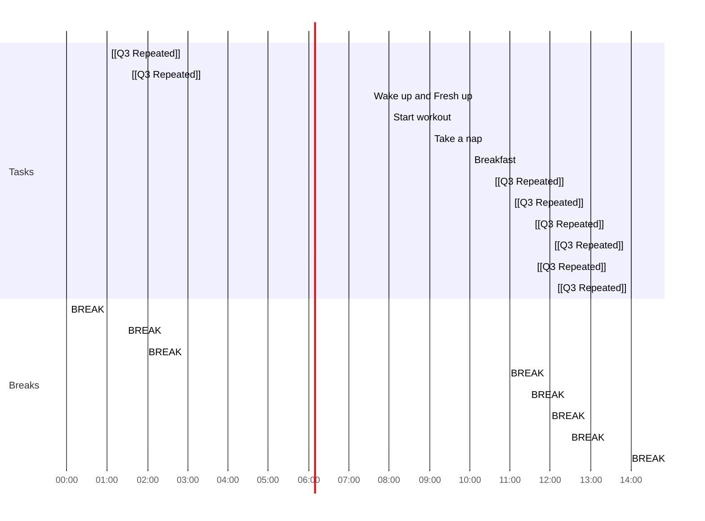

## Day Planner

- [x] 00:00 BREAK
- [ ] 01:00 [[Q3 Repeated]]
- [ ] 01:25 BREAK
- [ ] 01:30 [[Q3 Repeated]]
- [ ] 01:55 BREAK
- [ ] 07:30 Wake up and Fresh up
- [ ] 08:00 Start workout
- [ ] 09:00 Take a nap
- [ ] 10:00 Breakfast
- [ ] 10:30 [[Q3 Repeated]]
- [ ] 10:55 BREAK
- [ ] 11:00 [[Q3 Repeated]]
- [ ] 11:25 BREAK
- [ ] 11:30 [[Q3 Repeated]]
- [ ] 11:55 BREAK
- [ ] 12:00 [[Q3 Repeated]]
- [ ] 12:25 BREAK
- [ ] 13:30 [[Q3 Repeated]]
- [ ] 13:55 BREAK
- [ ] 14:00 [[Q3 Repeated]]
- [ ] 