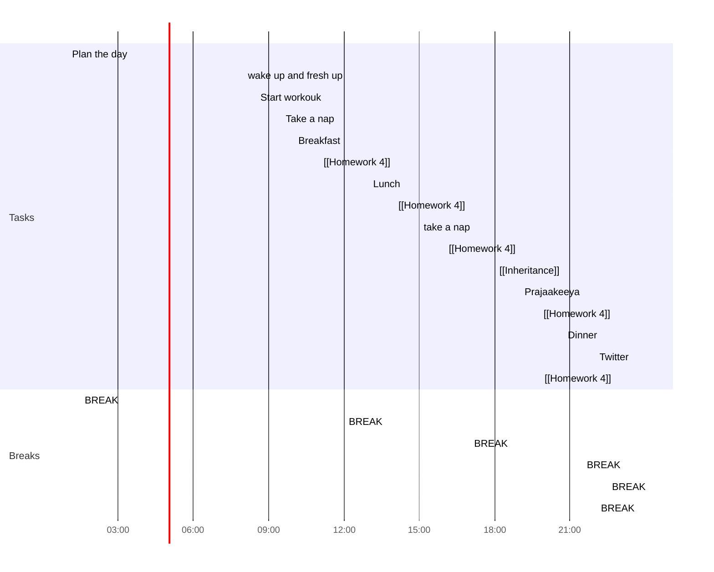

## Day Planner

#todo
- [x] 01:00 Plan the day
	- Thank you, Obsidian Community
- [x] 01:30 BREAK
- [x] 08:00 wake up and fresh up
- [x] 08:30 Start workouk
- [x] 09:30 Take a nap
- [x] 10:00 Breakfast
- [ ] 11:00 [[Homework 4]]
- [ ] 12:00 BREAK
- [ ] 13:00 Lunch
- [ ] 14:00 [[Homework 4]]
- [ ] 15:00 take a nap
- [ ] 16:00 [[Homework 4]]
- [ ] 17:00 BREAK
- [ ] 18:00 [[Inheritance]]
- [ ] 19:00 Prajaakeeya
- [ ] 19:45 [[Homework 4]]
- [ ] 20:45 Dinner
- [ ] 21:30 BREAK
- [ ] 22:00 Twitter
- [ ] 22:30 BREAK
- [ ] 22:50 [[Homework 4]]
- [ ] 23:45 BREAK