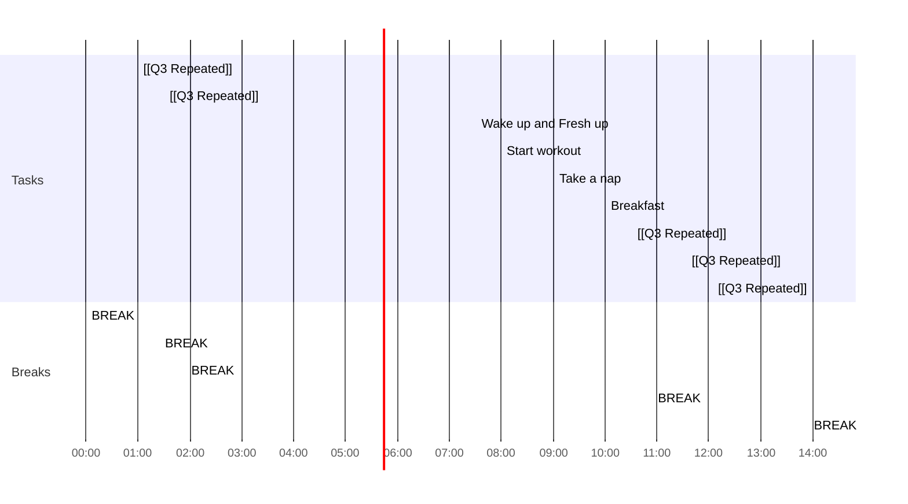

## Day Planner

- [x] 00:00 BREAK
- [x] 01:00 [[Q3 Repeated]]
- [x] 01:25 BREAK
- [x] 01:30 [[Q3 Repeated]]
- [x] 01:55 BREAK
- [x] 07:30 Wake up and Fresh up
- [x] 08:00 Start workout
- [x] 09:00 Take a nap
- [x] 10:00 Breakfast
- [x] 10:30 [[Q3 Repeated]]
- [x] 10:55 BREAK
- [x] 13:30 [[Q3 Repeated]]
- [x] 13:55 BREAK
- [x] 14:00 [[Q3 Repeated]]
- [ ] 