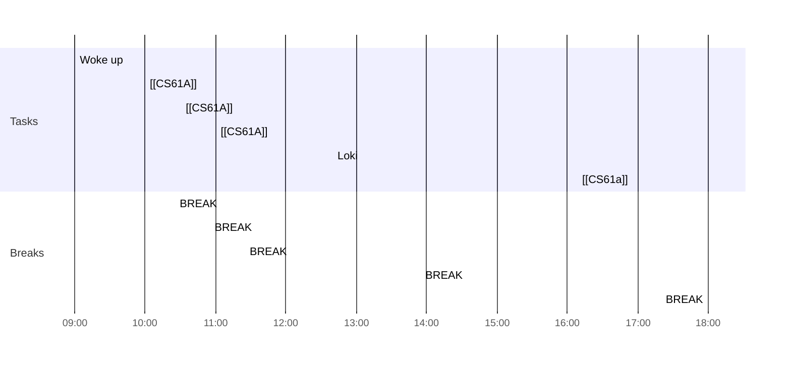

## Day Planner

- [x] 09:00 Woke up
- [x] 10:00 [[CS61A]]
- [x] 10:25 BREAK
- [x] 10:30 [[CS61A]]
- [x] 10:55 BREAK
- [x] 11:00 [[CS61A]]
- [x] 11:25 BREAK

- [x] 12:40 Loki
- [x] 13:55 BREAK
- [x] 16:08 [[CS61a]]
- [x] 18:00 BREAK
