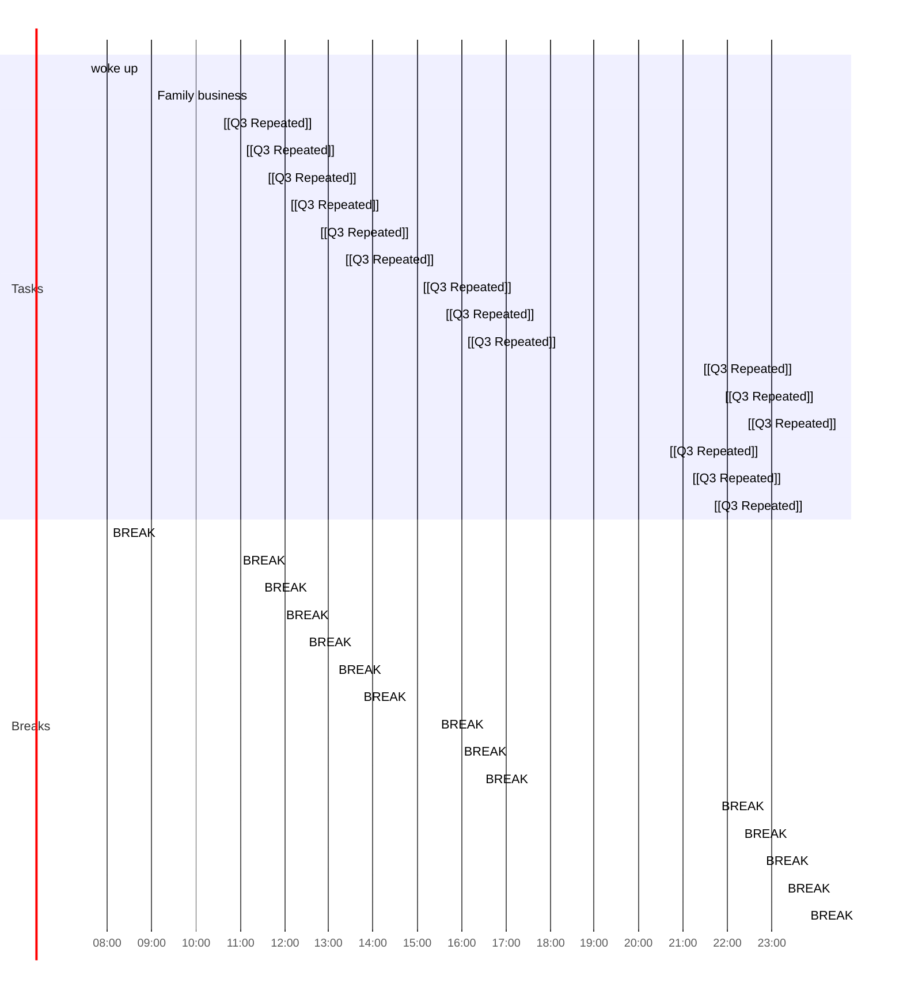

## Day Planner

- [x] 07:30 woke up
- [x] 08:00 BREAK
- [x] 09:00 Family business
- [x] 10:30 [[Q3 Repeated]]
- [x] 10:55 BREAK
- [x] 11:00 [[Q3 Repeated]]
- [x] 11:25 BREAK
- [x] 11:30 [[Q3 Repeated]]
- [x] 11:55 BREAK
- [x] 12:00 [[Q3 Repeated]]
- [x] 12:25 BREAK
- [x] 12:40 [[Q3 Repeated]]
- [x] 13:05 BREAK
- [x] 13:15 [[Q3 Repeated]]
- [x] 13:40 BREAK
- [x] 15:00 [[Q3 Repeated]]
- [x] 15:25 BREAK
- [x] 15:30 [[Q3 Repeated]]
- [x] 15:55 BREAK
- [x] 16:00 [[Q3 Repeated]]
- [x] 16:25 BREAK
- [x] 21:20 [[Q3 Repeated]]
- [x] 21:45 BREAK
- [x] 21:50 [[Q3 Repeated]]
- [x] 22:15 BREAK
- [x] 22:20 [[Q3 Repeated]]
- [x] 22:45 BREAK
- [x] 22:50 [[Q3 Repeated]]
- [x] 23:15 BREAK
- [x] 23:20 [[Q3 Repeated]]
- [x] 23:45 BREAK
- [x] 23:50 [[Q3 Repeated]]
