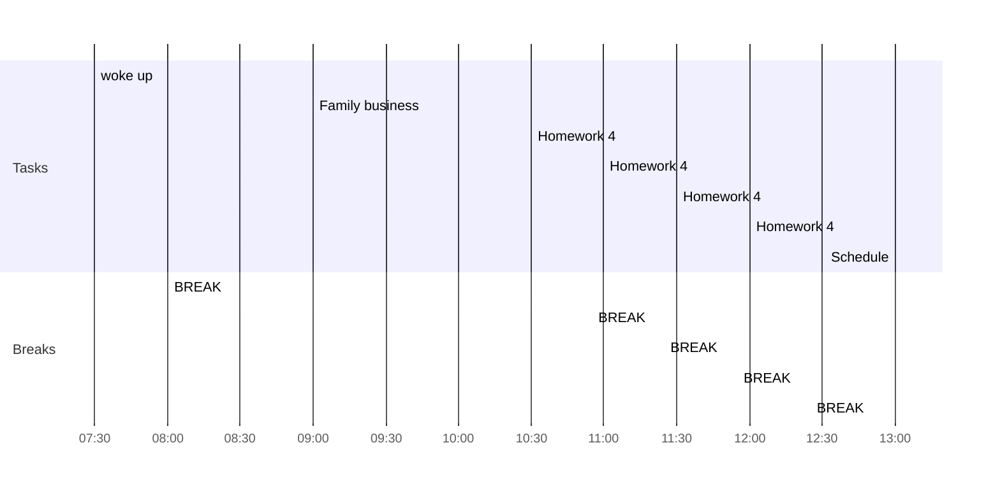

## Day Planner

- [x] 07:30 woke up
- [x] 08:00 BREAK
- [x] 09:00 Family business
- [x] 10:30 Homework 4
- [x] 10:55 BREAK
- [x] 11:00 Homework 4
- [x] 11:25 BREAK
- [ ] 11:30 Homework 4
- [ ] 11:55 BREAK
- [ ] 12:00 Homework 4
- [ ] 12:25 BREAK
- [ ] 13:00 Schedule